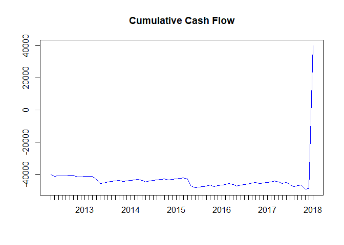
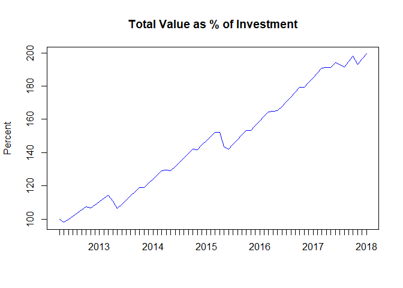
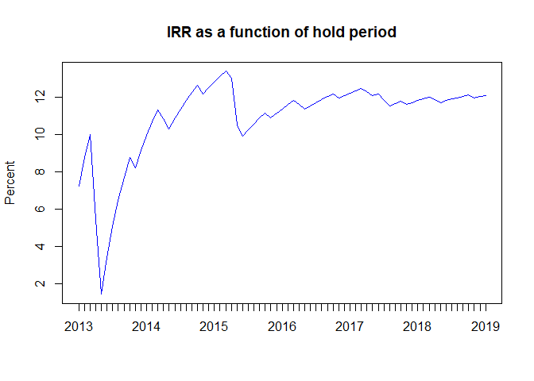

### Abstract
In this post we illustrate some techniques for building cash flow models using zoo objects.  We also demonstrate methods to analyze cash flows including net present value, IRR, payback and graphical methods.  Files for this post are found at https://github.com/karlpolen/zoocashflow .

### Some preliminary comments on zoo objects and time indices

Zoo objects provide a way of representing time series information.  They require at most one entry for each time period.  If you are analyzing a problem with multiple entries for the same time period, you should consider using a data frame.  

To use zoo objects, load zoo and lubridate.  Lubridate has handy functions for working with dates and you will want it around.


```r
require(zoo)
require(lubridate)
```


A zoo object is a vector or matrix with a timeline as an attribute (attached to the rows if a matrix).  While the zoo framework is quite general in what it will accept as an index, we will confine our discussion to cases where you are considering annual, quarterly, monthly and daily data.

To record annual data, you could do this.

```r
annual=zooreg(1:10,start=2014)
annual
```

```
## 2014 2015 2016 2017 2018 2019 2020 2021 2022 2023 
##    1    2    3    4    5    6    7    8    9   10
```

Once you've created a zoo object, you extract the timeline as follows.


```r
time(annual)
```

```
##  [1] 2014 2015 2016 2017 2018 2019 2020 2021 2022 2023
```

```r
class(time(annual))
```

```
## [1] "numeric"
```

You will note that the time index is numeric class.  This works if all your data are annual, but  you will often want to be more granular. 

Most business prjects can be analyzed as monthly or quarterly data.  Here are a couple of examples using `yearmon` and `yearqtr`.  Note that the class of the time series is no longer `numeric`, but `yearmon` or `yearqtr`.


```r
monthly=zooreg(1:10,start=as.yearmon("2014-1"),freq=12)
monthly
```

```
## Jan 2014 Feb 2014 Mar 2014 Apr 2014 May 2014 Jun 2014 Jul 2014 Aug 2014 
##        1        2        3        4        5        6        7        8 
## Sep 2014 Oct 2014 
##        9       10
```

```r
class(time(monthly))
```

```
## [1] "yearmon"
```

```r
annual.yearmon=zooreg(1:10,start=as.yearmon("2014-1"))
annual.yearmon
```

```
## Jan 2014 Jan 2015 Jan 2016 Jan 2017 Jan 2018 Jan 2019 Jan 2020 Jan 2021 
##        1        2        3        4        5        6        7        8 
## Jan 2022 Jan 2023 
##        9       10
```

```r
quarterly=zooreg(1:10,start=as.yearqtr("2014-1"))
quarterly
```

```
## 2014 Q1 2015 Q1 2016 Q1 2017 Q1 2018 Q1 2019 Q1 2020 Q1 2021 Q1 2022 Q1 
##       1       2       3       4       5       6       7       8       9 
## 2023 Q1 
##      10
```

```r
class(time(quarterly))
```

```
## [1] "yearqtr"
```

`yearmon` and `yearqtr` are stored as decimal values with the whole number being the year and the decimal representing the portion of the year represented by the fraction.  Time differences are expressed in years and fractions of a year.  Look at the following examples to understand this behavior.


```r
t1=as.yearqtr(2014)
t2=as.yearqtr("2014-2")
t2-t1
```

```
## [1] 0.25
```

```r
t3=as.yearqtr(2014.5)
t3-t1
```

```
## [1] 0.5
```

You can also use a `Date` type as a zoo index.  Time differences when using `Date` types are expressed in days as the a time difference class.  In the prior examples of building zoo objects, we used the function `zooreg` which is useful when you have a series of consecutive values, one for each time period.  If the values are non-consecutive you use the `zoo` function in which you provide the values and the vector of dates.  Here are some examples.


```r
dailyvals=zoo(1:3,as.Date(c("2014-1-3","2014-5-1","2014-6-12")))
dailyvals
```

```
## 2014-01-03 2014-05-01 2014-06-12 
##          1          2          3
```

```r
diff(time(dailyvals))
```

```
## Time differences in days
## [1] 118  42
```

You can do calculations with zoo objects.  Zoo will always match the time index when attempting to do math and will object if there are different classes or times.  We create two zoo objects with overlapping time indices to illustrate.  First we demonstrate that you can sum a zoo object and the answer is no longer a zoo object.


```r
a1=zooreg(1:10,start=2014)
a2=zooreg(1:10,start=2015)
sum(a1)
```

```
## [1] 55
```
Next we show pairwise addition.  It only performs the addition on elements where it can match the time, dropping mismatches.

```r
a1+a1
```

```
## 2014 2015 2016 2017 2018 2019 2020 2021 2022 2023 
##    2    4    6    8   10   12   14   16   18   20
```

```r
a1+a2
```

```
## 2015 2016 2017 2018 2019 2020 2021 2022 2023 
##    3    5    7    9   11   13   15   17   19
```

This behavior is not very useful, so we need a better approach to calculating a sum.  `merge` ends up being helpful.

```r
merge(a1,a2)
```

```
##      a1 a2
## 2014  1 NA
## 2015  2  1
## 2016  3  2
## 2017  4  3
## 2018  5  4
## 2019  6  5
## 2020  7  6
## 2021  8  7
## 2022  9  8
## 2023 10  9
## 2024 NA 10
```

Now we create a function to add a group of time series and return a vector which is the sum of entries for each index period where there are entries.


```r
zoosum=function(...) {
  sumz=merge(...)
  zoo(rowSums(sumz,na.rm=TRUE),time(sumz))
}
zoosum(a1,a2)
```

```
## 2014 2015 2016 2017 2018 2019 2020 2021 2022 2023 2024 
##    1    3    5    7    9   11   13   15   17   19   10
```

Finally, we illustrate some date arithmetic with functions from lubridate.  Let's say a payment is due every month on the fifth of the month.  You do this to get the payment date.


```r
paymentdates=as.Date("2014-5-5")+months(0:25)
paymentdates
```

```
##  [1] "2014-05-05" "2014-06-05" "2014-07-05" "2014-08-05" "2014-09-05"
##  [6] "2014-10-05" "2014-11-05" "2014-12-05" "2015-01-05" "2015-02-05"
## [11] "2015-03-05" "2015-04-05" "2015-05-05" "2015-06-05" "2015-07-05"
## [16] "2015-08-05" "2015-09-05" "2015-10-05" "2015-11-05" "2015-12-05"
## [21] "2016-01-05" "2016-02-05" "2016-03-05" "2016-04-05" "2016-05-05"
## [26] "2016-06-05"
```

You can extract the year of each payment date as follows.


```r
year(paymentdates)
```

```
##  [1] 2014 2014 2014 2014 2014 2014 2014 2014 2015 2015 2015 2015 2015 2015
## [15] 2015 2015 2015 2015 2015 2015 2016 2016 2016 2016 2016 2016
```

Here is another example.  Say you have a payroll of $10,000 every other Friday and you want to budget the monthly amount for the next couple years.  The `aggregate` function is handy for this.


```r
payroll=zoo(10000,as.Date("2014-5-23")+(14*1:52))
payroll.yearmon=aggregate(payroll,by=as.yearmon(time(payroll)),sum)
head(payroll)
```

```
## 2014-06-06 2014-06-20 2014-07-04 2014-07-18 2014-08-01 2014-08-15 
##      10000      10000      10000      10000      10000      10000
```

```r
payroll.yearmon
```

```
## Jun 2014 Jul 2014 Aug 2014 Sep 2014 Oct 2014 Nov 2014 Dec 2014 Jan 2015 
##    20000    20000    30000    20000    20000    20000    20000    30000 
## Feb 2015 Mar 2015 Apr 2015 May 2015 Jun 2015 Jul 2015 Aug 2015 Sep 2015 
##    20000    20000    20000    20000    20000    30000    20000    20000 
## Oct 2015 Nov 2015 Dec 2015 Jan 2016 Feb 2016 Mar 2016 Apr 2016 May 2016 
##    20000    20000    20000    30000    20000    20000    20000    20000
```

This shows how you can navigate from one index class to another.  Generally, you're probably better off to stick with a single index class as you build your model.  If you don't, you'll need to keep careful track of your indices make sure you know how any mismatches are handled or resolved.  The functions I present in this post assume indices in multiple zoo objects have been conformed to a single class.

### Example -- investing in a rental house
Let's illustrate this from a simple example of an investment project.  In this example, we analyze cash flows using the `yearmon` index class.  For a discussion of loan amortization functions, see the earlier post http://rpubs.com/kpolen/16816.  


```r
require(zoo)
require(lubridate)
source('dcf_funs.r',echo=FALSE)
# we're going to accumulate our cash flow objects in a list cf and balance sheet objects in a list bs
cf=list()
bs=list()
#buy the house in April 2012 
buydate=as.yearmon("2012-4")
cf$buy.house=zoo(-200000,buydate)
#put a mortgage on it
mortgage=-.8*cf$buy.house
rate=.04
amort=30
mortvars=loanamort(bal0=mortgage,apr=TRUE,r=rate,n=amort,freq=12)
#calculate market rent with a function grow
growth=.025
market=grow(r=growth,c=1200,n=10,freq=12,start=buydate)
#here is a sequence of leases on the house.  we assume some vacancy between tenants
#there is a below market lease on the house upon acquisition, but step up to market for later lease
lease1=zooreg(rep(1000,12),start=buydate,freq=12)
lease2=zooreg(rep(market[as.yearmon("2013-6")],24),start=as.yearmon("2013-6"),freq=12)
lease3=zooreg(rep(market[as.yearmon("2015-7")],24),start=as.yearmon("2015-7"),freq=12)
lease4=zooreg(rep(market[as.yearmon("2017-9")],24),start=as.yearmon("2017-9"),freq=12)
cf$revenue=zoosum(lease1,lease2,lease3,lease4)
#calculate the value of the house appreciating at same rate as rental growth
housevalue=grow(r=growth,as.numeric(-cf$buy.house),start=buydate+1/12,n=10,freq=12)
bs$housevalue=housevalue
#property taxes are 1% of the house value, paid half in May and half in November
propertytax=-.01*as.numeric(housevalue)[12*0:10]
ptmay=zoo(.5*propertytax,as.yearmon("2012-5")+0:9)
ptnov=zoo(.5*propertytax,as.yearmon("2012-11")+0:9)
cf$property.tax=zoosum(ptmay,ptnov)
#insurance in 1000 per year paid at acquisition and each anniversary
cf$insurance=zoo(-1000,buydate+0:9)
#pay $30 per week for landscape maintenance
maintweekly=zoo(rep(-30,520),as.Date("2012-4-12")+(7*(0:519)))
cf$maintenance=aggregate(maintweekly,as.yearmon(time(maintweekly)),sum)
#pay $300 for utilities in months when you don't have a tenant
allmonths=seq(start(cf$revenue),end(cf$revenue),by=1/12)
monthswtenant=time(cf$revenue)
notenant=allmonths[which(!allmonths %in% monthswtenant)]
cf$utilities=zoo(-300,notenant)
#replace the air conditioner when it goes out
cf$new.air.conditioner=zoo(-3500,as.yearmon("2015-5"))
#fix up the house a couple months before selling it
selldate=as.yearmon("2018-1")
cf$fixup=zoo(-2000,selldate-(2/12))
# add mortgage information to the cash flows
cf$mortgage.proceeds=zoo(mortvars$bal0,buydate)
cf$interest=-mortvars$int
cf$principal=-mortvars$prin
cf$mortgage.payoff=-mortvars$bal[selldate]
cf$sell.house=housevalue[selldate]
#
#In building cash flows, we haven't worried about conforming end dates -- for example, the mortgage data goes out 30 years.  We now trim everything to a beginning and ending date window.  window.list applies the zoo window function to each element in the list.
#
cf.w=window.list(cf,buydate,selldate)
# append a total to the list which is the zoosum of all the other items
cf.w=addtotal.list(cf.w)
# format the information in a table (ready for xtable if you are using that)
cf.table=make.table(cf.w,by='year',time.horizontal=TRUE)
round(cf.table)
```

```
##                        2012  2013  2014  2015  2016  2017    2018
## buy.house           -200000     0     0     0     0     0       0
## revenue                9000 11646 14821 13977 15603 13289    1372
## property.tax          -2046 -2097 -2149 -2203 -2258 -2315       0
## insurance             -1000 -1000 -1000 -1000 -1000 -1000       0
## maintenance           -1140 -1560 -1560 -1590 -1560 -1560    -120
## utilities                 0  -600     0  -300     0  -600       0
## new.air.conditioner       0     0     0 -3500     0     0       0
## fixup                     0     0     0     0     0 -2000       0
## mortgage.proceeds    160000     0     0     0     0     0       0
## interest              -4245 -6273 -6155 -6032 -5904 -5772    -475
## principal             -1866 -2894 -3012 -3134 -3262 -3395    -289
## mortgage.payoff           0     0     0     0     0     0 -142149
## sell.house                0     0     0     0     0     0  230037
## Total                -41297 -2778   945 -3782  1619 -3352   88377
```

```r
# you can show the timeline on the vertical axis and aggregate to quarterly or monthy
cf.table2=make.table(cf.w,by='quarter',time.horizontal=FALSE)
round(cf.table2[,c(1,2,3,4)])
```

```
##         buy.house revenue property.tax insurance
## 2012 Q2    -2e+05    3000        -1023     -1000
## 2012 Q3     0e+00    3000            0         0
## 2012 Q4     0e+00    3000        -1023         0
## 2013 Q1     0e+00    3000            0         0
## 2013 Q2     0e+00    1235        -1048     -1000
## 2013 Q3     0e+00    3705            0         0
## 2013 Q4     0e+00    3705        -1048         0
## 2014 Q1     0e+00    3705            0         0
## 2014 Q2     0e+00    3705        -1075     -1000
## 2014 Q3     0e+00    3705            0         0
## 2014 Q4     0e+00    3705        -1075         0
## 2015 Q1     0e+00    3705            0         0
## 2015 Q2     0e+00    2470        -1102     -1000
## 2015 Q3     0e+00    3901            0         0
## 2015 Q4     0e+00    3901        -1102         0
## 2016 Q1     0e+00    3901            0         0
## 2016 Q2     0e+00    3901        -1129     -1000
## 2016 Q3     0e+00    3901            0         0
## 2016 Q4     0e+00    3901        -1129         0
## 2017 Q1     0e+00    3901            0         0
## 2017 Q2     0e+00    3901        -1157     -1000
## 2017 Q3     0e+00    1372            0         0
## 2017 Q4     0e+00    4115        -1157         0
## 2018 Q1     0e+00    1372            0         0
```

```r
#
# Now let's finish a market value balance sheet.
# Of course, you can change the names of the list for nicer printing.  
# Note that the function for make.table for balance sheet items is lastinvec (instead of the default sum).  
bs$loan.balance=-mortvars$bal
bs=window.list(bs,buydate,selldate)
bs=addtotal.list(bs)
names(bs)=c('Market Value','Loan Balance','Equity')
make.table(bs,fun=lastinvec)
```

```
##                    2012       2013       2014       2015       2016
## Market Value  202901.65  207974.19  213173.55  218502.89  223965.46
## Loan Balance -158134.09 -155240.41 -152228.84 -149094.57 -145832.61
## Equity         44767.56   52733.78   60944.71   69408.31   78132.85
##                    2017       2018
## Market Value  229564.60  230037.46
## Loan Balance -142437.75 -142148.68
## Equity         87126.84   87888.78
```

### Analyzing cash flows
Let's calculate an IRR and NPV.


```r
irr.z(cf.w$Total)
```

```
## [1] 0.1181856
```

```r
#NPV of the project at inception
npv.z(.08,cf.w$Total)
```

```
## [1] 9719.659
```

```r
#NPV of the remaining cash flow as May, 2014
npv.z(.08,cf.w$Total,now=as.yearmon("2014-5"))
```

```
## [1] 62497.21
```

Plot a cumulative cash flow


```r
plot(cumsum(cf.w$Total),main='Cumulative Cash Flow',xlab='',ylab='',col='blue')
```

<!-- -->

Plot TVPI


```r
investment=-as.numeric(cf$buy.house+cf$mortgage.proceeds)
cumcf=investment+cumsum(cf.w$Total)
cumval=zoosum(cumcf,zoo(investment,buydate),bs$Equity[-length(bs$Equity)])
plot(100*cumval/investment,col='blue',main='Total Value as % of Investment',xlab='',ylab='Percent')
```

<!-- -->

Now, let's run sensitivity of the IRR to the hold date.


```r
# make a function that calculates the IRR as a function of hold date
irr.ans=vector()
newcf=cf
newcf[['mortgage.payoff']]=NULL
newcf[['fixup']]=NULL
newcf[['sell.house']]=NULL
house.hold=function(dateofsale,newcf) {
selldate=dateofsale
newcf$fixup=zoo(-2000,selldate-(2/12))
newcf$mortgage.payoff=-mortvars$bal[selldate]
newcf$sell.house=housevalue[selldate]
newcf.w=window.list(newcf,buydate,selldate)
newcf.w=addtotal.list(newcf.w)
ans=irr.z(newcf.w$Total)
return(ans)
}
daterange=as.yearmon(seq(2013,2019,by=1/12))
for (i in 1:length(daterange)) {
  irr.ans[i]=house.hold(daterange[i],newcf)
 }
irr.ans.z=zoo(irr.ans,daterange)
plot(100*irr.ans.z,main='IRR as a function of hold period',xlab='',ylab='Percent',col='blue')
```

<!-- -->

So, the peak IRR is achieved if you had sold the house to an unsuspecting person right by the air conditioner went out!

### A few more comments on the NPV function

The arguments to the NPV function are shown here.


```r
args(npv.z)
```

```
## function (i, cf, freq = 1, apr = FALSE, now = NULL, drop.bef.now = TRUE) 
## NULL
```

When people talk about NPV, by convention they usually mean at inception of a project.  But you can specify now as any value. Suppose you have an annuity that will pay you $10,000 a year for 20 years starting in 2025.  The value discounted at 6% in 2014 is calculated as follows.


```r
annuity=zooreg(rep(10000,20),start=2025)
npv.z(.06,annuity,now=2014)
```

```
## [1] 64047.44
```

If you do `drop.bef.now=FALSE`, it works like a future value function.

For example. . .


```r
npv.z(.1,zoo(1,2012),now=2014,drop.bef.now=FALSE)
```

```
## [1] 1.21
```

Finally, the `apr` feature let's you state a discount rate as an annual percentage rate.  Suppose you borrow $10,000 to buy car at 7% interest for four years.  Here are NPV calculations with and without the apr feature.


```r
payment=(loanamort(.07,bal0=10000,apr=TRUE,freq=12,n=4))$pmt
payment
```

```
## [1] 239.4624
```

```r
npv.z(.07,c(-10000,rep(payment,48)),apr=FALSE,freq=12)
```

```
## [1] 41.78151
```

```r
npv.z(.07,c(-10000,rep(payment,48)),apr=TRUE,freq=12)
```

```
## [1] -8.964207e-11
```

### Functions used in this post are copied below


```r
loanamort=function(r=NULL,bal0=NULL,pmt=NULL,n=NULL,apr=FALSE,start=NULL,freq=1) {
  ans=list()
  risnull=is.null(r)
  bal0isnull=is.null(bal0)
  if(!bal0isnull) {
    if(is.zoo(bal0)) start=time(bal0)
    bal0=as.numeric(bal0)
  }
  pmtisnull=is.null(pmt)
  nisnull=is.null(n)
  if(1<sum(c(risnull,bal0isnull,pmtisnull,nisnull))) stop('loanamort error -- need to provide at least three parameters')
  n.f=n
  if(apr) n.f=n*freq
  if(!risnull) {
    if(apr) {
      r.f=r/freq
    } else {
      r.f=-1+(1+r)^(1/freq)
    }
  } else {
    cf=c(-bal0,rep(pmt,n.f))
    if(0<=sum(cf)) {
      rootrange=c(0,1.01) } else {
      rootrange=c(1,1000)
      }
    d=(uniroot(function(d) {sum(cf*d^(0:n.f))},rootrange))$root
    r.f=(1/d)-1
  }
  d=1/(1+r.f)
  f=1+r.f
  if(pmtisnull) pmt=(bal0*r.f)/(1-d^n.f)
  perp=pmt/r.f
  if(bal0isnull) bal0=perp-perp*(d^n)
  if(pmt<=(r.f*bal0)) stop(paste(pmt,r.f*bal0,'payment must be greater than interest'))
  if(nisnull) n.f= ceiling(log((1-(bal0*r.f)/pmt))/log(d))
  i=1:n.f
  bal=pmax(0,((bal0*f^i)-(((pmt*f^i)-pmt)/r.f)))
  balall=c(bal0,bal)
  int=balall[i]*r.f
  prin=-diff(balall)
  if(!is.null(start)) {
    bal=zooreg(bal,start=start+1/freq,freq=freq)
    int=zooreg(int,start=start+1/freq,freq=freq)
    prin=zooreg(prin,start=start+1/freq,freq=freq)
  }
  if(apr) {
    ans$r=r.f*freq
    ans$n=n.f/freq
  } else {
    ans$r=-1+((1+r.f)^freq)
    ans$n=n.f
  }
  ans$pmt=pmt
  ans$bal0=bal0
  ans$freq=freq
  ans$start=start
  ans$apr=apr
  ans$bal=bal
  ans$prin=prin
  ans$int=int
  return(ans)
}
lastinvec=function(x,na.rm=TRUE) {
  ans=tail(x,1)
  if(na.rm & is.na(ans)) ans=0
  return(ans)
}

grow=function(r,c,n,freq=1,start=1,retclass='zoo') {
  if('zoo'==retclass & start==1) {
    if(is.zoo(c)) start=time(c)
  }
  n=n*freq
  r=-1+(1+r)^(1/freq)
  ts=as.numeric(c)*(1+r)^(0:(n-1))
  if ('zoo'==retclass) {
    ts=zooreg(ts,start=start,freq=freq)
  }
  return(ts)
}
zoosum=function(...) {
  sumz=merge(...)
  zoo(rowSums(sumz,na.rm=TRUE),time(sumz))
}
window.list=function(x,start,end) {
  ans=x
  for (i in 1:length(x)) {
    ans[[i]]=window(x[[i]],start=start,end=end)
  }
  return(ans)
}
addtotal.list=function(x) {
  total=do.call(zoosum,x)
  x$Total=total
  return(x)
}
merge0=function(...) {
  merge(...,fill=0)
}
make.table=function(x,by='year',time.horizontal=TRUE,fun=sum) {
  table=do.call(merge0,x)
  if (by=='year') table=aggregate(table,by=year(time(table)),fun)
  if (by=='quarter') table=aggregate(table,by=as.yearqtr(time(table)),fun)
  if (by=='month') table=aggregate(table,by=as.yearmon(time(table)),fun)
  timeline=time(table)
  table=as.matrix(table)
  rownames(table)=as.character(timeline)
  if(time.horizontal) table=t(table)
  return(table)
}
irr.z=function(cf.z,gips=FALSE) {
  irr.freq=1
  #if("Date"!=class(time(cf.z))) {warning("need Date class for zoo index"); return(NA)}
  if(any(is.na(cf.z))) return(NA)
  if(length(cf.z)<=1) return(NA)
  if(all(cf.z<=0)) return(NA)
  if(all(cf.z>=0)) return(NA)
  if(sum(cf.z)==0) return (0)
  if(!is.zoo(cf.z)) {
    timediff=-1+1:length(cf.z)
  } else {
    timeline=time(cf.z)
    timediff=as.numeric(timeline-timeline[1])
    if ("Date"== class(timeline)) irr.freq=365
  }
  if (sum(cf.z)<0) {
    rangehi=0
    rangelo=-.01
    i=0
    # low range on search for negative IRR is -100%
    while(i<100&(sign(npv.znoadjust(rangehi,cf.z,irr.freq,timediff))==sign(npv.znoadjust(rangelo,cf.z,irr.freq,timediff)))) {
      rangehi=rangelo
      rangelo=rangelo-.01
      i=i+1
    }} else {
      rangehi=.01
      rangelo=0
      i=0
      # while hi range on search for positive IRR is 100,000%
      while(i<100000&(sign(npv.znoadjust(rangehi,cf.z,irr.freq,timediff))==sign(npv.znoadjust(rangelo,cf.z,irr.freq,timediff)))) {
        rangelo=rangehi
        rangehi=rangehi+.01
        i=i+1
      }}
  npv1=npv.znoadjust(rangelo,cf.z,irr.freq,timediff)
  npv2=npv.znoadjust(rangehi,cf.z,irr.freq,timediff)
  if (sign(npv1)==sign(npv2)) return(NA)
  cf.n=as.numeric(cf.z)
  #calculate with uniroot if cash flow starts negative and ends positive otherwise do your own search
  if((cf.n[1]<0)&(cf.n[length(cf.n)]>0)) {
    ans=uniroot(npv.znoadjust,c(rangelo,rangehi),cf=cf.z,freq=irr.freq,tdiff=timediff)
    apr=ans$root } else {
      int1=rangelo
      int2=rangehi
      for (i in 1:40) {
        inta=mean(c(int1,int2))
        npva=npv.znoadjust(inta,cf.z,irr.freq,timediff)
        if(sign(npva)==sign(npv1)) {
          int1=inta
          npv1=npva
        } else {
          int2=inta
          npv2=npva
        }}
      apr=mean(int1,int2)  
    }
  # convert IRR to compounding at irr.freq interval
  ans=((1+(apr/irr.freq))^irr.freq)-1
  # convert IRR to GIPS compliant if requested
  if (gips) {
    if(cf.z[1]==0)  cf.z=cf.z[-1]
    dur=index(cf.z)[length(cf.z)]-index(cf.z)[1]
    if(dur<irr.freq) ans=(1+ans)^((as.numeric(dur))/irr.freq)-1
  }
  return (ans)
}
npv.znoadjust=function(i,cf.z,freq,tdiff) {
  d=(1+(i/freq))^tdiff
  sum(cf.z/d)
}

npv.z=function(i,cf,freq=1,apr=FALSE,now=NULL,drop.bef.now=TRUE) {
  if(!is.zoo(cf)) {
    timeline=(1:length(cf))/freq
  } else {
    timeline=time(cf)
  }
  iszooreg=("Date"!=class(timeline))
  if(!iszooreg) {
    freq=365
  } else if ("yearmon" == class(timeline)) {
    freq=12
  } else if ("yearqtr" == class(timeline)) {
    freq=4
  }
  if (iszooreg&apr) {
    i=-1+(1+i/freq)^freq
  } else if (iszooreg&(!apr)) {
    i=i
  } else if ((!iszooreg)&apr) {
    i=i/freq
  } else if((!iszooreg)&(!apr)) {
    i=-1+((1+i)^(1/freq))
  }
  if (is.null(now)) now=timeline[1] 
  if (drop.bef.now) {
    cf=cf[timeline>=now]
    timeline=timeline[timeline>=now]
  }
  ind=as.numeric(timeline-now)
  d=(1+i)^ind
  sum(cf/d)
}
```
